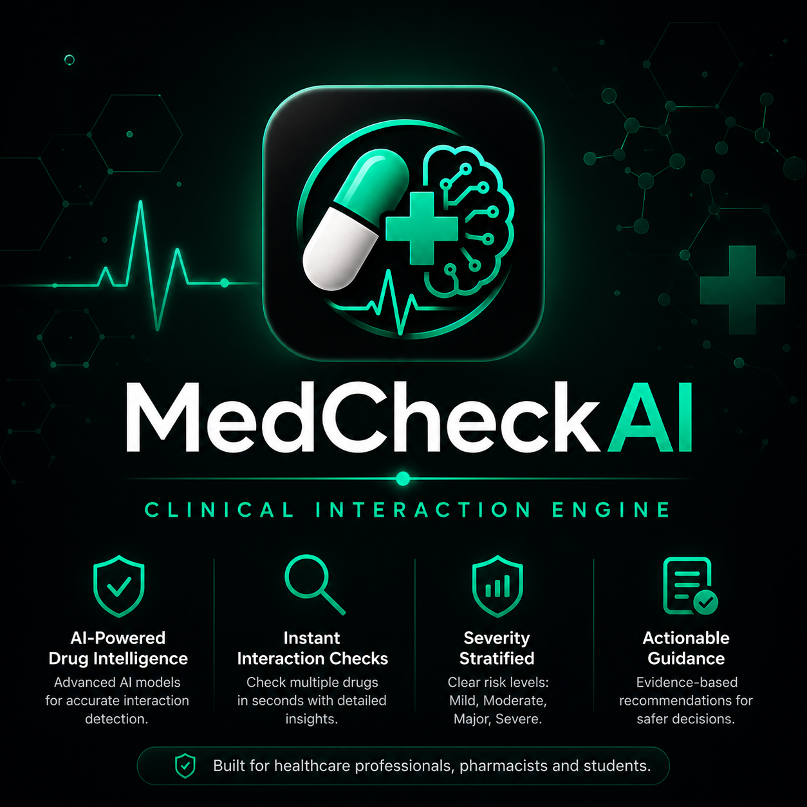

# MedCheck AI 💊🤖

AI-powered Clinical Interaction Engine designed to identify potential drug interactions instantly.

## 🔹 Features
- Drug interaction checking
- Severity alerts
- Fast AI-powered responses
- Healthcare-focused learning project

## 🛠 Built With
- AI tools
- Modern web technologies
- Healthcare knowledge

## 📌 Purpose
This project was created to explore the intersection of Pharmacy, Clinical Safety, and Artificial Intelligence.

## 🌐 Live Website
https://medcheckbuddy-lovable-app.lovable.app

## 👩‍⚕️ Author
Anjum Fatima  
Pharm-D Student | Exploring AI in Healthcare
## 🚀 Project Preview

